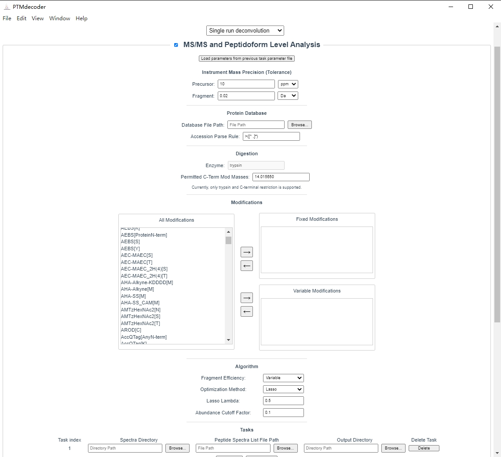

PTMdecoder is a software tool for discriminating and quantifying **isobaric modification peptidoforms (IMPs)** from multiplexed mass spectra in data-dependent acquisition (DDA) bottom-up proteomics. PTMdecoder imposes **no restrictions** on the type or number of peptidoforms, and requires no prior spectral library for individual peptidoforms. It delivers both the peptidoform- and site-level results, offering novel insights into protein modification states that are often overlooked by current proteomic data analysis workflows.

PTMdecoder can be used as a standalone executable, with GUI or command line.

Free for academic uses. Licensed under BSD-3-Clause-Clear license.

# Table of Contents
- [Features](#features)
- [Installation](#installation)
- [Getting Started](#getting-started)

# Features

- **Accurate Discrimination and Quantification of IMPs** - High-confidence discrimination and accurate quantification of co-eluted IMPs​​ in multiplexed mass spectrometry data.
- **​Comprehensive IMP Enumeration** - Support of any user-specified PTM types under typical CID/HCD fragmentation rules, and automatical generation of ​all IMP candidates​ by enumerating PTM combinations, enabling systematic exploration.
- **Library-free Deconvolution** - No requirement of experimental or predicted spectra for individual IMPs, enabling cost-effective and flexible analysis.
- **Easy to Use** - User-friendly interface, built-in control-experiment comparisons, and visualization of XIC deconvolution results.

# Installation

**Hardware and OS requirements:** A computer with a 64-bit version Windows 10 (and above) is required to run PTMdecoder, and 16GB of RAM or more.

**Environment setup:** To use PTMdecoder, the user needs to download and install the **MATLAB Runtime R2022a (9.12)** from [MathWorks website](https://www.mathworks.com/products/compiler/matlab-runtime.html)

**Installation:** To install the compiled standalone software of PTMdecoder:

1. Download the installer *"PTMdecoder Setup \<version>.exe"*
2. Execute the installer and follow its instructions.

   You may see a Windows Defender Warning, since our installer is not digitally signed.
   
   Click on “More Info”, and then “Run anyways”.

   It takes a few seconds to complete the installation on a typical desktop computer.

# Getting started

This section guides you through the core workflow of ​PTMdecoder​ for deconvoluting multiplexed mass spectra, and accurately discriminating and quantifying IMPs. For advanced functionalities (e.g., batch processing or pairwise comparison), please refer to [PTMdecoder website](http://fugroup.amss.ac.cn/software/PTMdecoder/PTMdecoder.html).

## Step 1: Prepare Input Files

Required files:

(Example data for all the following three types of files is provided along with the standalone executable. After installation, you can access these files in the ***demo*** folder located in the application’s installation directory)

- **Mass Spectra Files**: Raw spectra in mgf/ms1/ms2 formats (pre-converted via [pParse](https://pfind.net/software/pParse/index.html)). See User Manual for the pParse version and usage.
- **​Search Results File**: currently supports only a custom "peptide spectra list" (.txt) format. See User Manual for the details about the format.
- ​**Protein Sequence Database**: FASTA file containing protein sequences.

## Step 2: Set Parameters

1. Launch *"PTMdecoder.exe"* and select the *"Single Run Deconvolution"* workflow. Enable "MS/MS and Peptidoform Level Analysis" analysis and disable "Site Level Analysis".
2. Set the basic parameters like *"Modifications"*.
3. Specify the file paths:
   - **Protein Database:** demo/database/human_histone_H4_E_coli_comb_rev.fasta
   - **Spectra Directory:** demo/spectra/
   - **Peptide Spectra List File Path:** demo/pepSpecFile.txt
   - **Output Directory:** demo/result/

## Step 3: Execute Analysis

Click the ​**Save Parameter & Run**​ button to generate a reusable *".param"* parameter file in the *"Output Directory"* and start IMP discrimination and quantification.

**Runtime:**

- **Demo Dataset:** ~20 seconds
- It takes a few minutes to complete the analysis for larger datasets on a typical desktop computer.

**Example screenshot:**   

## Reuse Parameter File

1. Launch "PTMdecoder.exe" and select the "Single Run Deconvolution" workflow. Enable "MS/MS and Peptidoform Level Analysis" and disable "Site Level Analysis".
2. Click the ​​"Load parameter from previous task parameter file"​​ button under the ​MS/MS and Peptidoform Level Analysis​ section to browse and load a pre-saved parameter file (.param), which will automatically fill all relevant configurations. (*"demo/task.param"* in demo dataset)
3. Check the Results:

   - The results are saved in the *"Output Directory"* (e.g. "demo/result/" folder).
   - The expected results are in the same *"result"* folder with the prefix *"expected_"* for comparison.

---

For more information about PTMdecoder and more test data, please see [PTMdecoder website](http://fugroup.amss.ac.cn/software/PTMdecoder/PTMdecoder.html).
